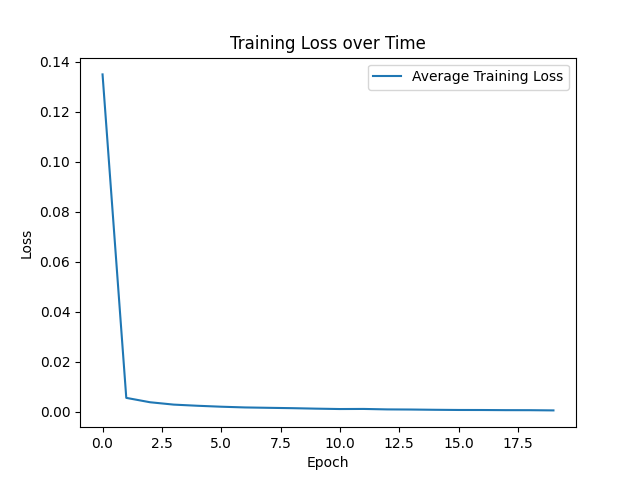

### 装甲板数字识别

- **模型架构**

    > 模型包含两个 *block* 和一个*fc层*
    >> - 每个 *block* 包括一层 *Conv2d* ,一层 *MaxPool2d* , 一层 *ReLU* 和 一层 *BatchNorm2d*
    >> 
    >> - *fc层* 将980个参数降至长度为8的 *output*

***

- **文件架构**
```Bash
NUMBERRECOGNITION
├── cal_mean_stddev.py
├── image.png
├── number_recognition_trainset
│   ├── colored
│   └── gray
├── recognize_colored
│   ├── model_num.py
│   ├── predict_num.py
│   ├── __pycache__
│   └── train.py
├── recognize_gray
│   ├── model.py
│   ├── predict.py
│   ├── __pycache__
│   └── train.py
└── REPORT.md

// cal_mean_stddev.py用来计算训练集image像素的mean和stddev 
```
>注意: `recognize_colored` 为适配后续任务经过改造, 运行时可能效果不佳

***

- **使用说明**
  > - 训练 *model* 请直接运行 `model.py` 文件. 训练集及测试集路径由 `model.py` 文件下的  *train_dataset* 和 *test_dataset* 指定

  > - 推理请运行`predict.py`.在 *root* 处修改进行推理的图片路径.

- **效果图**
    > 
- **总结**
    >在运行模型时发现 *BatchNorm* 模块对提高精度异常有效. 实验发现: 在未使用 *BatchNorm* 时准确率只有16.67%, 而在使用时准确率可达到99.67%.
