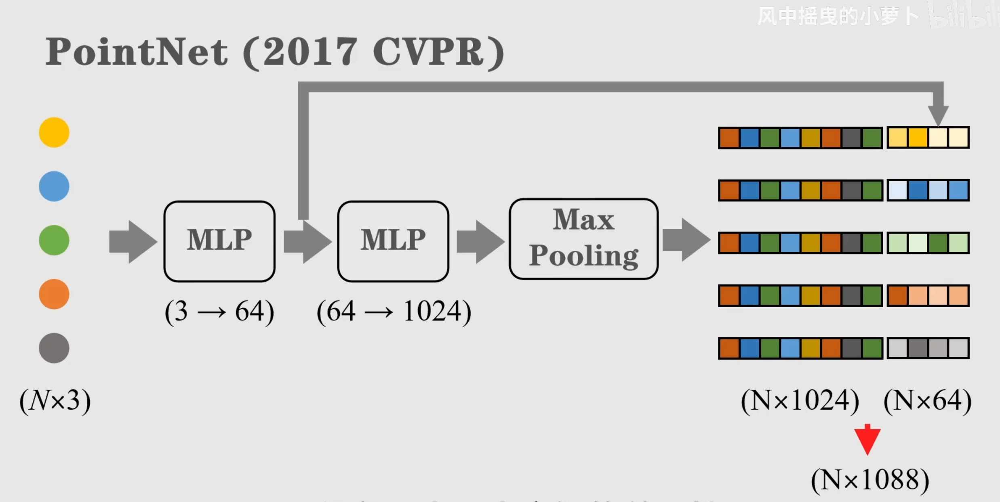
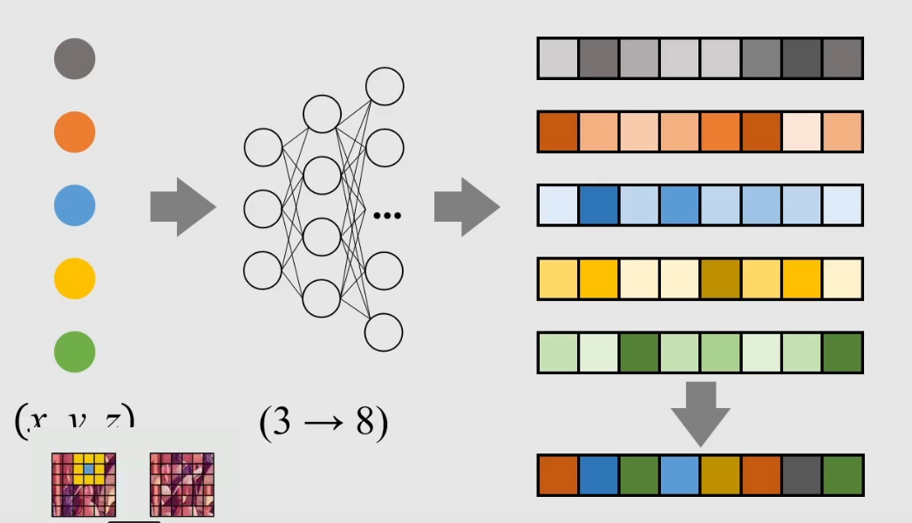
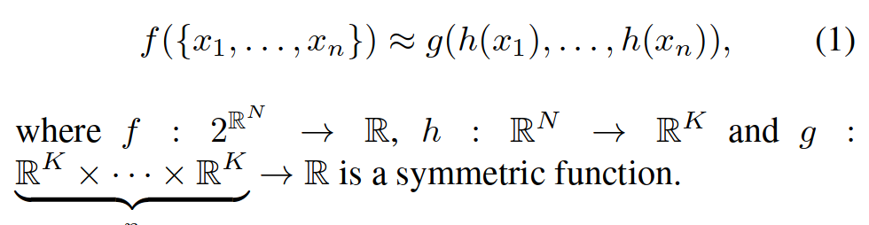
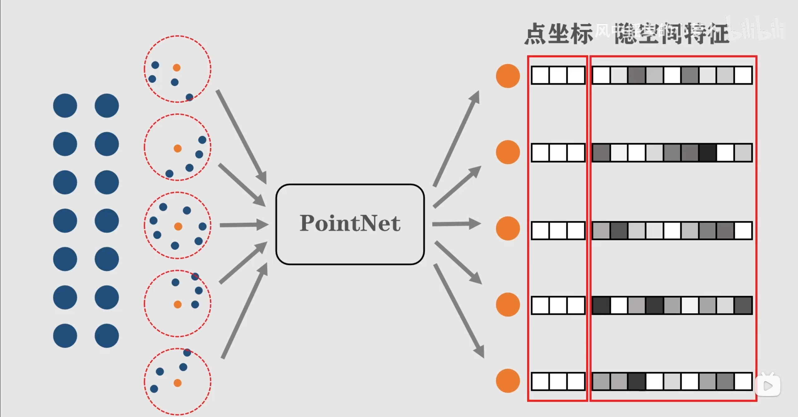
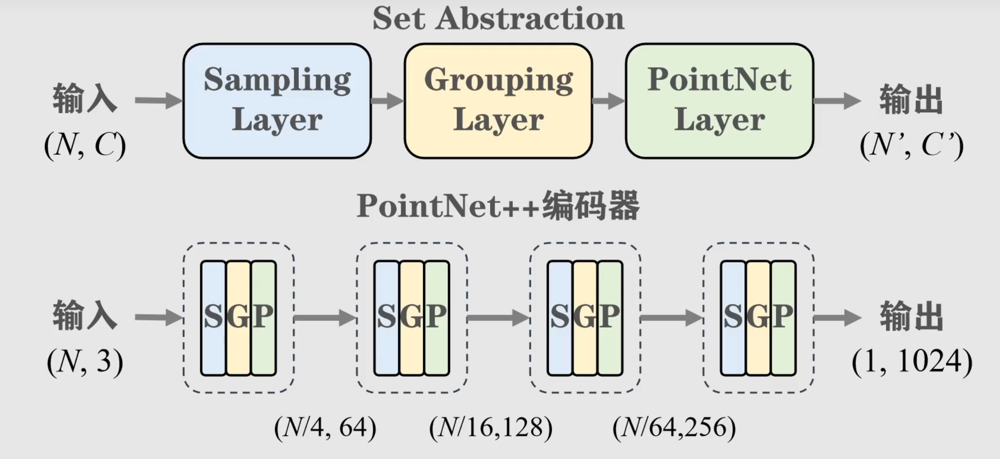
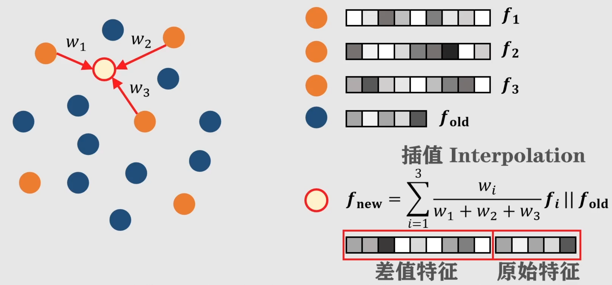
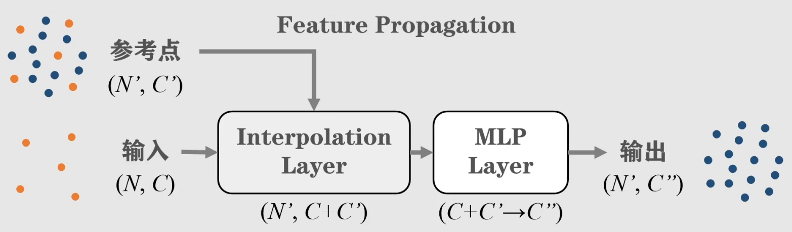

- 阅读PointNet论文：
PointNet: Deep Learning on Point Sets for 3D Classification and Segmentation，只读1-4部分；
PointNet++: Deep Hierarchical Feature Learning on Point Sets in a Metric Space，只读1-3部分；
- 形成一篇笔记，大致介绍下：
  1. PointNet是如何解决点云的无序性问题的？
  2. 什么是特征对齐模块？
  3. PointNet++在上一代的基础上做了什么改进？


### 点云的无序性



`we approximate h by a multi-layer perceptron network and g by a composition of a single variable function and a max pooling function.`
- 对每一个`point`,都经过`MLP`进行处理,也就是`(1)`中的`h`,从而得到```feature```
- 在```feature```的各个维度上执行```max pooling```操作
- 作者除`max pooling`外还测试了`mean pooling`和 `weighted sum pooling`, `max pooling`效果最好

### 特征对齐模块
`The semantic labeling of a point cloud has to be invariant if the point cloud undergoes certain geometric transformations, such as rigid transformation. We therefore expect that the learnt representation by our point set is invariant to these transformations.`

`A natural solution is to align all input set to a canonical space before feature extraction.`

`This idea can be further extended to the alignment of feature space, as well.`

- 我们可以通过另一个`alignment network`来对齐input的特征空间, 同时向`Loss function`中加入`regularization term`:

  驱使网络学习到的`feature transformation matrix`成为一个正交矩阵, 从而保证`input`经过变换后信息不丢失

### PointNet++的改进
- `PointNet`的不足:
> - 点云中并非所有点都有均等的重要性, 具有代表性的局部结构是更重要的. 因此, pointnet对于大尺度环境点云的处理效果不佳.
> `However, by design PointNet does not capture local structures induced by the metric space points live in, limiting its ability to recognize fine-grained patterns and generalizability to complex scenes.`

- `PointNet++`的改进:
> 1. `Ball Query`: 对于每一个特征点, 以其为中心, 找到距离其最近的4个点, 以这5个点为一个`Group`
> 2. 将每一个`Group`输入到`PointNet Layer`中, 得到`local feature`, 并将其特征点的坐标置于`local feature`之前.
> 
> 3. 对于上述的`Ball Query`和`PointNet Layer`,可以重复多次
> 
> 4. 然后对于点云中所有的点, 取距离最近的三个特征点, 进行特征融合,从而保证将编码器学习到的特征传播到所有的点.
> 
> 